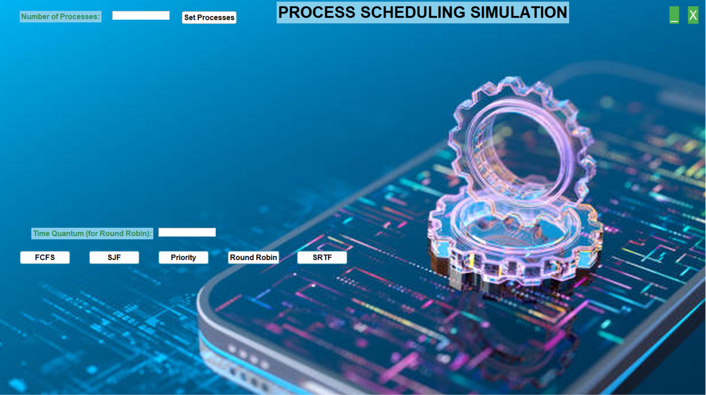
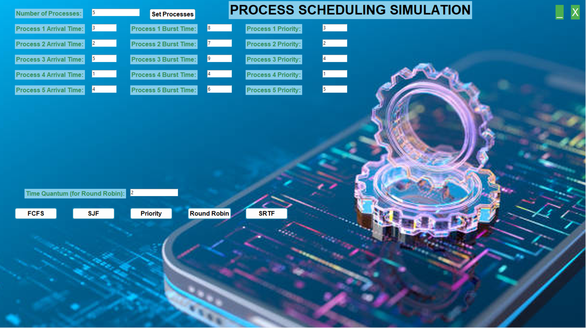
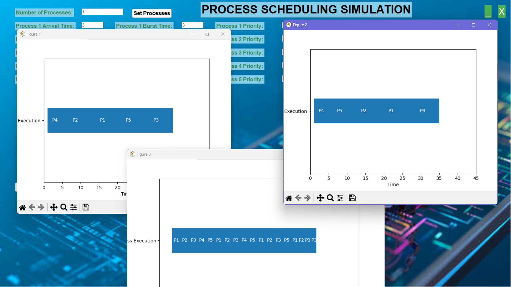

# Process Scheduling Simulator

## Overview

The Process Scheduling Simulator is a graphical user interface (GUI) application that simulates various CPU scheduling algorithms. Users can input process details, select a scheduling algorithm, and visualize the scheduling process through Gantt charts. The simulator supports multiple algorithms, including:

- First-Come, First-Served (FCFS)
- Shortest Job Next (SJN)
- Priority Scheduling
- Round Robin
- Shortest Remaining Time First (SRTF)

## Features

- Dynamic input for process attributes (arrival time, burst time, priority)
- Visualization of process scheduling through Gantt charts
- Fullscreen mode support for enhanced visualization on larger screens
- Customizable time quantum for Round Robin scheduling
- User-friendly interface with intuitive controls

## Requirements

- Python 3.x
- Tkinter (usually included with standard Python installations)
- Pillow (for image handling)
- Matplotlib (for plotting Gantt charts)

## Installation

1. **Clone the repository:**

   ```bash
   git clone <repository-url>
   cd <repository-directory>

## Install required packages:

- You can install the required packages using pip. Run the following command in your terminal:
- pip install pillow matplotlib

## Download a background image:

- Ensure you have a suitable background image (e.g., operating_system.jpg). Place it in the same directory as the script or adjust the path in the code accordingly.

## Input process details:

- Enter the number of processes you want to simulate.
- Click on "Set Processes" to generate input fields for each process.
- Fill in the arrival time, burst time, and priority for each process.
- Select a scheduling algorithm:
- Choose from the available scheduling algorithms by clicking the corresponding button (FCFS, SJF, Priority, Round Robin, or SRTF).

## Screenshots
Below are screenshots showcasing different parts of the OS process Scheduling simulator.

### 1. Main Screen


### 2. Main Screen With Table


### 3. Gannt Charts


> **Note**: Place your screenshots in a folder named `screenshots` within the project directory. Ensure that the paths in this `README.md` file match the folder structure.

## Notes
- To toggle fullscreen mode, press the F11 key. You can exit fullscreen by pressing the Escape key.
- Ensure that the background image is high-resolution (at least 2K) for best results.

## Contributing
- If you would like to contribute to this project, feel free to submit a pull request or open an issue for any bugs or feature requests.

## License
- This project is licensed under the MIT License. See the LICENSE file for details.
